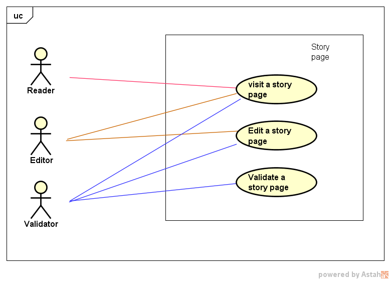

Vanir project expression of needs
=================================

Objectives
----------
What is the goal of History ? This is a very complex question which can be the subject of a philosophic book. This is not or claim here.
Without args too much, our point of view is that history is for :

- to know the story of past events most precisely as possible.
- to have or acquire a critical point of view on some past events.
- to acquire a critical sense on actual events or more generally on modern society.

Actually, most people known story by dates. For some (or most) schoolchildren, History is a hard school teaching with lots of "learn by heart".
Talking like this is simplifying what is the History at school. But the fact is that most people, when they left school don't have the feeling
they acquired on of the previous three points due to their school knowledge in History.

The Vanir project is a web site about history which has this three previous objectives.
This is an ambitious project.
And we hope, that maybe one day, History teachers will sometimes use it.

 .. à1515 marignan, Henry IV was murdered by Ravaillac, Charlemagne was crawn Imperator in 800, Constantinople was destroyed in 1453, July, 14th 1789 the take of the bastille, etc. But is it the right way to learn history. What is the interest to learn history ? Is it only to learn dates and old events which has nothing to do with the life of everydays

Example : 1515, the battle of Marignano
~~~~~~~~~~~~~~~~~~~~~~~~~~~~~~~~~~~~~~~

if you ask to every french people the question :
"What happened in 1515 ?" Or just "1515 ?". You will certainly have the answer : "Marignano" as an automatic answer.
If you ask for more detailed information, you may have a these answers : "Francis I", "Winning battle", "Italia" and may be "The Renaissance".
But is it the good information to remember about this events ? Do, the french people know the answer of these questions ?

- "Why Francis I attack Milan ?"
- "Was it a great battle" ?
- "What are the consequences of this battle for Milan ? For the France ? For Francis I himself ?"

Marignano is one of the battle of a war call the Great Italian Wars. Francis I is a new young crown king (20yo).
Francis I, need to establish his power and à Winning battle will be a good deal for him.
The battle is one of the first battle where the artillery was used in a large part.
The battle during two days (which was not common).
About 15,000 soldiers died in this battle which was also not common for the epoch.
Francis I win this battle but just close. But he return in france with the story of à Great Winning Battle.
The propaganda was very active ( "*The story is written by the winners*" )
Marignano is à very interesting battle which had some unique facts due to the Renaissance, new technologies.
This is a battle due to many fact, the Great italian war, a new crowned king etc.
The consequences for Italia, France, arts, Francis I are also very interesting.
But even if all french people know this battle with this date, All interesting facts about this battle are often ignored.
History is a science which can be used to learn more about the "Human Nature". With History we can more understand actual events. 
The objective of the Vanir project is to showcase causes and consequences about history events and not about dates.
In our Opinion, one of the key to better understand or world is to talk about causes and consequences.

Web site actors
---------------

Various actors can use the web site.
And here follows what each actor can do:

* The **reader** can :

    - find and read historical **story** pages.
    - He also has the possibility to navigate through **causes** and **consequences** of this story.

- The **editor** can :

    - create and edit historical **story** pages

- The **validator** can :

    - validate **story** contents.

- The **administrator** can : 

    - administrate the web site

.. +-----------------+-------------------------+--------------------+------------------------+
  | actor \\ action | historical events pages | events graphs      | web site configuration |
  +=================+=========================+====================+========================+
  | reader          | search / read           | browse             | read                   |
  +-----------------+-------------------------+--------------------+------------------------+
  | editor          | create / edit           | create / edit      | ✗                      |
  +-----------------+-------------------------+--------------------+------------------------+
  | validator       | validate / publish      | validate / publish | ✗                      |
  +-----------------+-------------------------+--------------------+------------------------+
  | administrator   | ✗                       | ✗                  | manage                 |
  +-----------------+-------------------------+--------------------+------------------------+

.. image:: ../../Uml/context.png
  :alt: context diagramm

Package decomposition
-------------------------

.. image:: ../../Uml/contextPackages.png
  :alt: context packages diagramm

The **Home** package contain the content of the **home page** of the website.

The **Story page** package all tho content of a **story**.
A story is an event (as the Marignano battle) with all the **causes** and **consequences** of the event.

THe **Administration** package is all tools used by the **administrator** to administrate the complete web site.

Use cases
---------

The Home page package
~~~~~~~~~~~~~~~~~~~~~

The Story package
~~~~~~~~~~~~~~~~~

The **reader** can visit a Story pages and read it's contents

The **editor** can visit a Story pages and read it's contents
The **editor** can edit a Story pages contents

The **validator** can visit a Story pages and read it's contents
The **validator** can check if the story page contents is **correct** or not.
The meaning on a **correct** page will be discuss later.
The **validator** can edit a Story pages contents to correct it.

The Adminitration package
~~~~~~~~~~~~~~~~~~~~~~~~~

