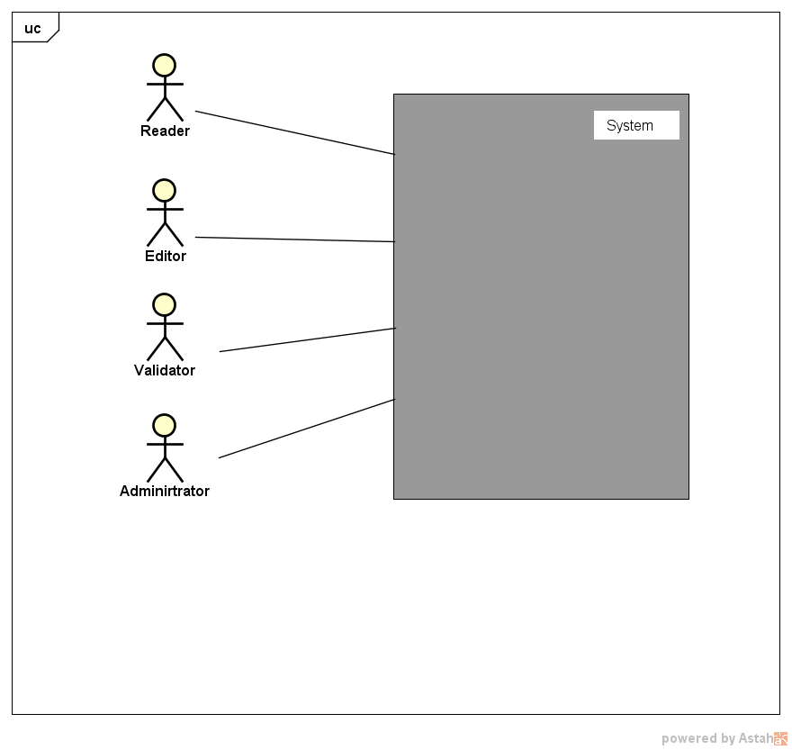
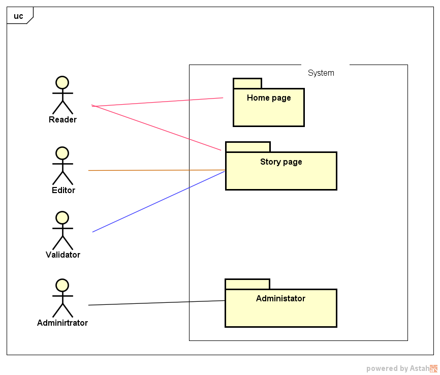

Vanir project expression of needs
=======================================

Context definition
----------------------

Vanir is a web site about history. Various actors can use the web site.
And here follows what each actor can do:

- The reader can find and read historical events pages. He also has the possibility to navigate through events graphs.
- The editor can create and edit historical events pages and edit the event graph
- The validator can validate pages and graphs.
- The administrator can administrate the web site

+-----------------+-------------------------+--------------------+------------------------+
| actor \\ action | historical events pages | events graphs      | web site configuration |
+=================+=========================+====================+========================+
| reader          | search / read           | browse             | read                   |
+-----------------+-------------------------+--------------------+------------------------+
| editor          | create / edit           | create / edit      | ✗                      |
+-----------------+-------------------------+--------------------+------------------------+
| validator       | validate / publish      | validate / publish | ✗                      |
+-----------------+-------------------------+--------------------+------------------------+
| administrator   | ✗                       | ✗                  | manage                 |
+-----------------+-------------------------+--------------------+------------------------+

Package decomposition
-------------------------

Use cases
-----------------------------

